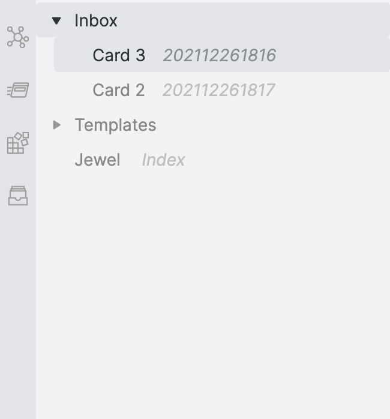
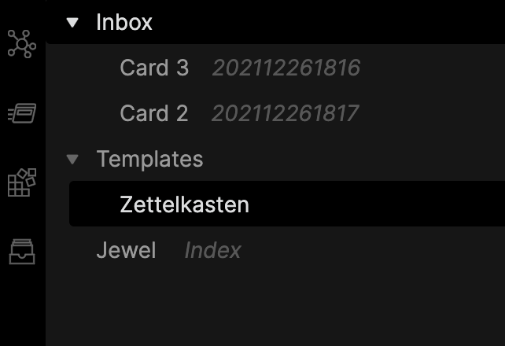

# Obsidian Markdown Title Sidecar

Shows the first markdown header found within a note next to the filename in the sidebar. No settings, just go.

Also replaces the titles in the graphview with the note's markdown title.

Forked from and based heavilly on [
file-explorer-markdown-titles](https://github.com/Dyldog/file-explorer-markdown-titles) and [file-explorer-note-count](https://github.com/ozntel/file-explorer-note-count)